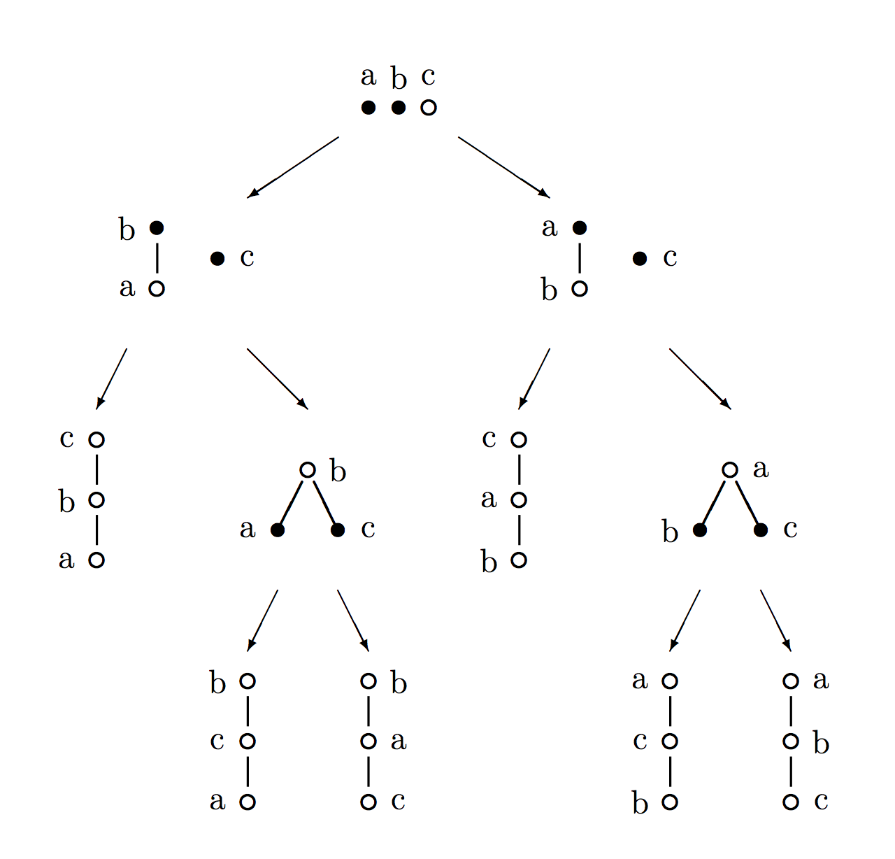

# Lecture 4 - Notes  

**January 14, 2016**  

## Comparison Based Lower Bounds

If we are solving a problem using only comparisons and there are $n$ possible outcomes, then in the worst case $\lceil \lg{n} \rceil$ comparisons are required.

#### Example

Suppose we have an array of $n$ sorted elements and we want to find some element $x$.

We could use binary search which will give us $O(\lg n)$. Instead we could use interpolation search $O\left(\lg{\left(\lg{n}\right)}\right)$.

### Sorting

Let say we're sorting again,

A sorting algorithm can be viewed as transforming a totally unordered set into a totally ordered set. Below we have converter the sorting diagram into a graph of partial order sets.

#### Partial Order Sets

_definition_: A binary relation ($\le$) on a set $S$ is a __partial order__ if,

* $a \le a$ for all $a \in S$ (reflexive)
* $a \le b$ and $b \le a$ implies $a = b$ (anti-symmetric)
* $a \le b$ and $b \le c$ implies $a \le c$ (transitive)

A partially ordered set is sometimes called a __poset__.

Some other variants of this ordering are,

* $\le$ Weak Partial Order
* $\lt$ Strick Partial Order
* $\equiv$ Equivalence Relations

### Hasse Diagram

_definition_: A __Hasse Diagram__ of a partially ordered set (poset) $S$ is a graph $G = (S,E)$ where $(a,c) \in E$ if and only if $a \lt c$ and there is no $b$ such that $a \lt b \lt c$

These posets can be combined into a __Hasse diagram__. Below are the Hasse diagrams for sorts of size 3 and 4.

