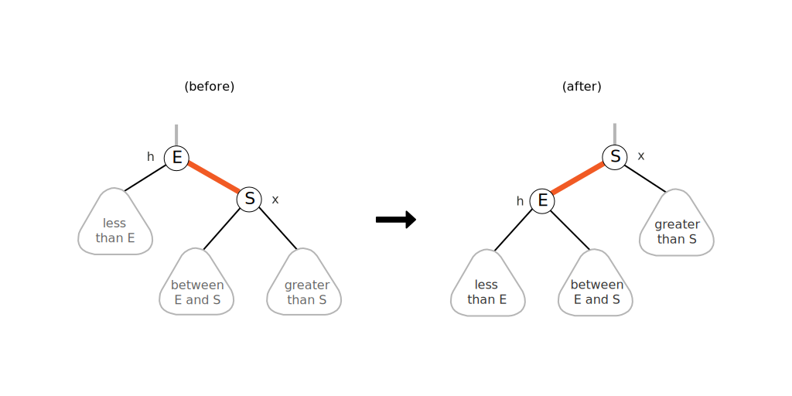

# Lecture 6 - Notes  

**January 21, 2016**  

## Balance Search Trees - Contined

### Red-Black Trees

A better way to represent a represent a 2-3 tree using a binary tree with one edge used as the "glue" edge to create a 3-node. We apply the arbitrary restriction the the red link are on the left.

_definition_: A __Red-Black Tree__ is a binary search tree where,

* No node has two red links connected to it
* Every path from root to null link has the same number of black links (perfect black balance)
* Red links lean left

this tree also has a one-to-one correspondence with a 2-3 tree. To map the correspondence the _red_ links are used to "join" 3-nodes.

#### Search

Search is the same as a normal binary search tree but faster because of better balance.


#### Left Rotation

To bring a (temporarily) right leaning edge to the left, we need to do a left rotation,



```java
private Node rotateLeft(Node h)
{
   assert isRed(h.right);
   Node x = h.right;
   h.right = x.left;
   x.left = h;
   x.color = h.color;
   h.color = RED;
   return x;
}
```

#### Right Rotation

To bring a left leaning edge to the right (temporarily), we do a right rotation,


```java
private Node rotateRight(Node h)
{
   assert isRed(h.left);
   Node x = h.left;
   h.left = x.right;
   x.right = h;
   x.color = h.color;
   h.color = RED;
   return x;
}
```

#### Color Flip

To recolour to split a (temporary) 4-node,

```java
private void flipColors(Node h)
{
   assert !isRed(h);
   assert isRed(h.left);
   assert isRed(h.right);
   h.color = RED;
   h.left.color = BLACK;
   h.right.color = BLACK;
}
```

#### Insertion

Insert a node we navigate the Binary Search Tree and perform the insertion using a red edge (so we maintain perfect black balance). Then we move back up the tree fixing any issues we create.

* Right child red, left child black: rotate left.
* Left child, left-left grandchild red: rotate right.
* Both children red: flip colors.

```java
private Node put(Node h, Key key, Value val)
{
   if (h == null) return new Node(key, val, RED);
   int cmp = key.compareTo(h.key);
   if      (cmp  < 0) h.left  = put(h.left,  key, val);
   else if (cmp  > 0) h.right = put(h.right, key, val);
   else if (cmp == 0) h.val = val;

    if (isRed(h.right) && !isRed(h.left))     h = rotateLeft(h);
    if (isRed(h.left)  && isRed(h.left.left)) h = rotateRight(h);
    if (isRed(h.left)  && isRed(h.right))     flipColors(h);
    return h; 
}
```

#### Balance

__Property__: The height of the tree is $\le 2 \lg N$ in the worst case.


