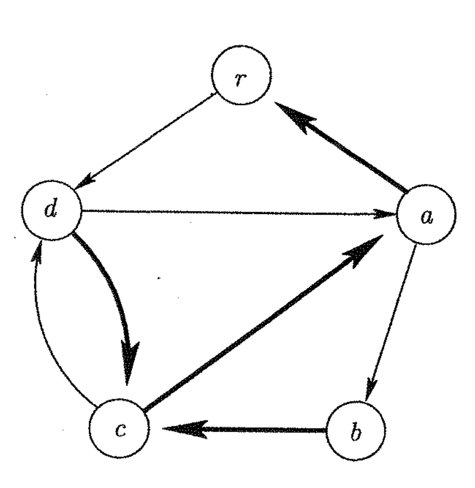

# Lecture 15 - Notes  

**March 3, 2016**  

## Eulerian Cycles

_definition_: A __Eulerian Cycle__ contains all the edges in the graph exactly once.

#### Theorem

A connected indirected graph has an Eulerian cycle if and only if the degree of each vertex is even.

#### Theorem

A connected (strongly connected) digraph has an Eulerian cycle if and only if the in-degree of each vertex equals its out-degree.

#### Algorithm

To find the Euclidean cycle in a digraph (enumerate the edges in the cycle), using a greedy process,

1. Preprocess the graph and make and in-tree with root $r$, compute $\bar{G}$ (reverse all edges). Then perform BFS to get the tree $T$. This is $O(|E| + |V|)$.

if we write the adjacency list for the graph,

$$\begin{aligned}
    r &\to d\\\\
    a &\to b \to r \\\\
    b &\to c \\\\
    c &\to d \to a \\\\
    d &\to a \to c \\\\
\end{aligned}$$

When we perform the algorithm, we'll get the list,

$$\begin{aligned}
    r \to d \to a \to a \to b \to c \to d \to c \to a \to r
\end{aligned}$$

_Why does it work?_ This works because, since, $G$ is Eulerian the algorithm ends at $r$. Imagine that $(v,w)$ is missing . Since the algorithm terminated $v \neq r$. Without loss of generality we can assume that $(v,w) \in T$. Since $C - P$ is balanced (where $P$ is the cycle found) there is an edge $(u,v)$ also not in $P$. Without loss of generality $(u,v) \in T$. Continuing in this manner we get a sequence of tree edges which eventually get back to $r$, a contradiction.

*This is actually what Frank Rusky wrote on the board. He makes no sense.*

### Efficiency

We can get all edges in $O(|E| + |V|)$.

## Hamiltonian Cycles

Finding all vertices in a Hamiltonian is an $nP$-complete problem.

## Planar Graphs

_definition_: A graph is __planar__ if there is a way to embedded it in the plane without crossing edges. The graph embedded in the plane is a __plane graph__ however a graph can be planar without being a plane graph. For example edges could be crossed but it has the potential to be rewritten into a plane graph.

### Are Two Graphs Isomorphic?

_definition_: Two graphs are __isomorphic__ if there is a bijection $\phi: V \to V^\prime$ such that for every edge in $V$,

$$\begin{aligned}
    (v,w) \in E \iff (\phi(v),\phi(w)) \in E
\end{aligned}$$

